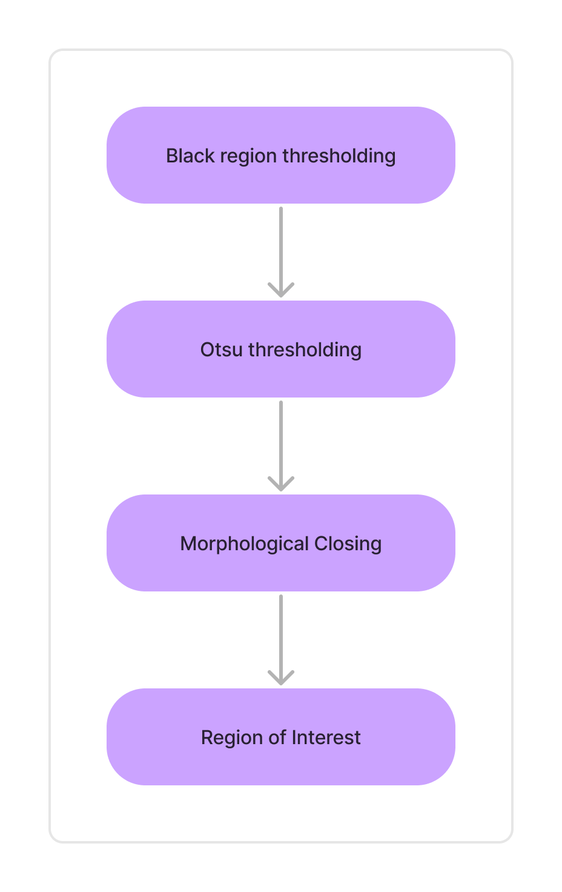
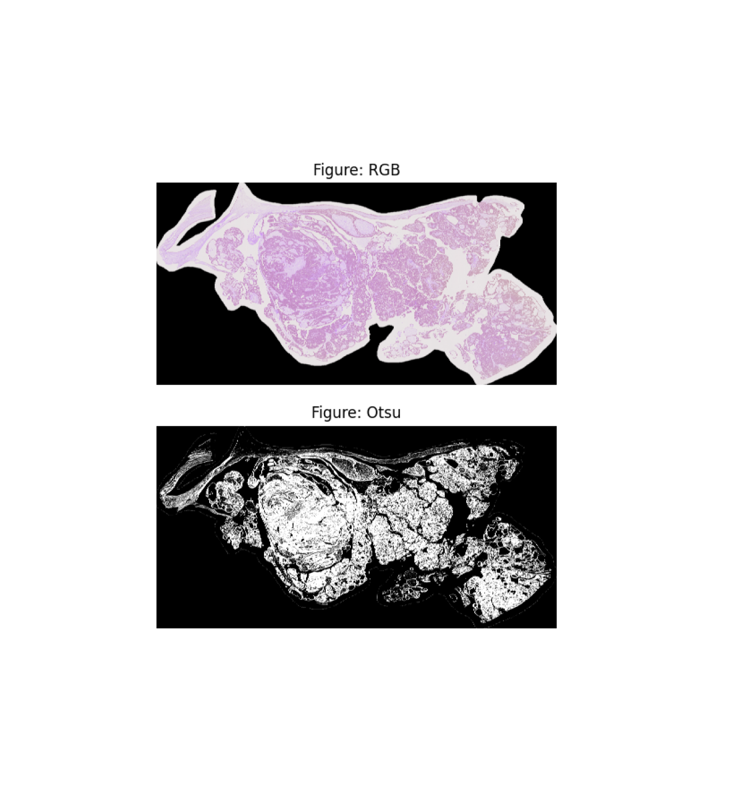

# CS640-UBCOCEAN-Competition

https://www.kaggle.com/competitions/UBC-OCEAN

[Installation](installation.md)

### Step 1: Patch Creation using CLAM
Feature Extraction using CLAM
[https://github.com/mahmoodlab/CLAM/tree/master](CLAM)

Preprocess using CLAM to extract and generate patches
The images we used were differetn in resolution and size from the TCGA, LUCC 

Instead using the presets [ubc_ocean.csv](ubc_ocean.csv)

CLAM pipeline 

OTSU thresholding 

 

Final result after Foreground background selection

### Step 2: Generating features using pre-trained model
Generate Features for all patches using Transpath [https://github.com/Xiyue-Wang/TransPath](TransPath) / Resnet

Download weights for ctranspath from the official repo

Run this code inside CLAM 
[extract_features_ctranspath.py](extract_features_ctranspath.py)

## Step 3:  Building graph using features for patches
Build Graph using the patch features generated in the preious step
[build_graph.py](build_graph.py)

## Step 4: Running models
Run graph based models for multiple instance learning
[train_simple_model.py](train_simple_model.py)

Scores for different models tried:

| Prediction model   | Feature Extraction model | Balanced Accuracy, mean%(std%) |
|--------------------|--------------------------|--------------------------------|
| CLAM               | Resnet50                 | 65.2 (5.2)                     |
| CLAM               | cTranspath               | 74.09 (7.3)                    |
| Graph Transformer  | Resnet18                 | 68.5 (3.8)                     |
| Graph Transformer  | cTranspath               | **77.3** (5.7)                 |
