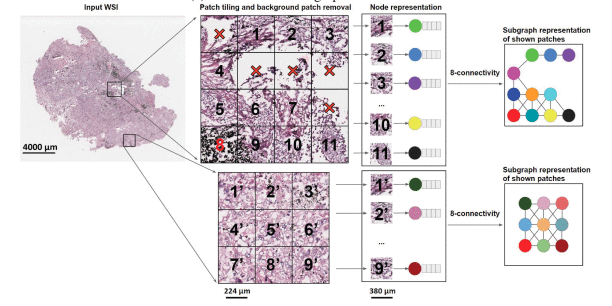

# CS640 Course Project

[Competition Link](https://www.kaggle.com/competitions/UBC-OCEAN)

### Installation Instructions
For installation instructions, refer to
[Installation Guide](installation.md)

## Introduction 
Our project involved tackling the UBC OCEAN competition, where we were provided with 70% of the data to build a model. Later, our code was evaluated on a hidden test set comprising 30% of the available data.

## Steps
1. Create Graph from image

Image Source: Graph Transformer(Yi et al.)

2. Creating graph based models on this data.

<!-- TODO: Add flow to show whole process -->

For more detailed description checkout 
[Project Summary](Project_summary.md)

## Model architecture
<!-- TODO: Add model diagrams -->

[Project Presentation](CS640_Project_Presentation.pdf)

[Project Report](Project_report.pdf)

## References

- Lu, M., Williamson, D., Chen, T., Chen, R., Barbieri, M., & Mahmood, F. (2021). Data-efficient and weakly supervised computational pathology on whole-slide images. *Nature Biomedical Engineering*, 5, 1-16. [DOI](https://doi.org/10.1038/s41551-020-00682-w)

- Wang, X., Yang, S., Zhang, J., Wang, M., Zhang, J., Yang, W., Huang, J., & Han, X. (2022). Transformer-based unsupervised contrastive learning for histopathological image classification. *Medical Image Analysis*, 81, 102559. [DOI](https://doi.org/10.1016/j.media.2022.102559)

- Zheng, Y., Gindra, R., Green, E., Burks, E., Betke, M., Beane, J., & Kolachalama, V. (2022). A Graph-Transformer for Whole Slide Image Classification. *IEEE Transactions on Medical Imaging*, PP. [DOI](10.1109/TMI.2022.3176598)

- Bradski, G. (2000). The OpenCV Library. *Dr. Dobb's Journal of Software Tools*. [Link](https://www.bibsonomy.org/bibtex/25fa6cccd386170d95ae17fd29a42303d/ross_mck)

- Otsu, N. (1979). A Threshold Selection Method from Gray-Level Histograms. *IEEE Trans. Syst. Man Cybern.* [Link](https://api.semanticscholar.org/CorpusID:15326934)

- He, K., Zhang, X., Ren, S., & Sun, J. (2015). Deep Residual Learning for Image Recognition. [arXiv](https://arxiv.org/abs/1512.03385)

- Ilse, M., Tomczak, J. M., & Welling, M. (2018). Attention-based Deep Multiple Instance Learning. [arXiv](https://arxiv.org/abs/1802.04712)
